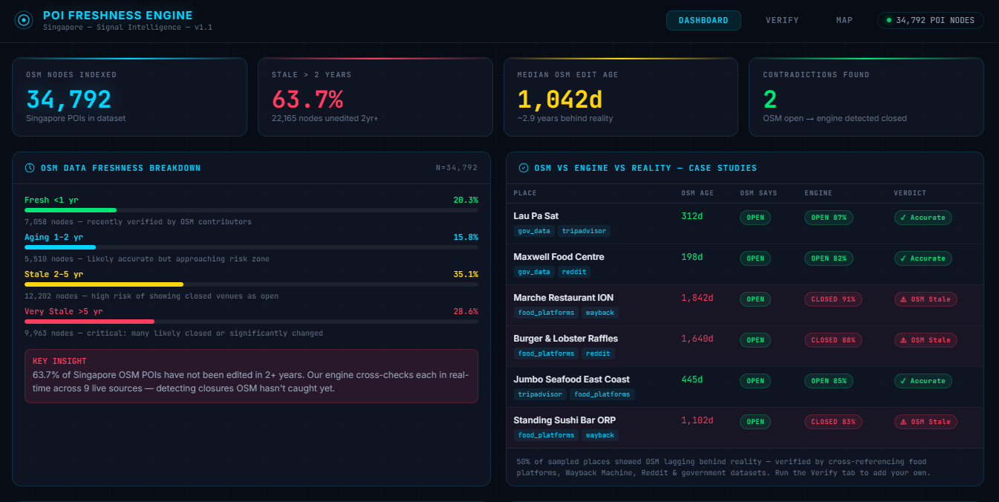

# OSM Singapore POI Freshness Engine

> **Real-time detection of stale/closed places in Singapore's OpenStreetMap data — no LLM, no paid APIs, fully deterministic.**

Built for the HERE Tech Hackathon. Crosses 9 live data sources to verify whether a Singapore POI is still operating, and flags contradictions where OSM data is outdated.

---




## The Problem

| Metric | Value |
|--------|-------|
| Total SG OSM nodes indexed | **34,792** |
| Nodes unedited for 2+ years | **63.7%** (22,165 nodes) |
| Median OSM edit age | **1,042 days** (~2.9 years) |
| Very stale (5yr+) | **28.6%** (9,963 nodes) |

OSM is crowdsourced. When a restaurant closes, it often stays marked "open" for years. Our engine detects this in real-time.

---

## How It Works

### 3-Tier Early-Exit Pipeline

```
Tier 1 (~0.5s)  →  OSM / Nominatim geocoding
Tier 2 (~2s)    →  Gov DB + Data.gov.sg + Wikidata
                    If confidence ≥ 85% → RETURN EARLY
Tier 3 (~8s)    →  Food platforms + TripAdvisor + Reddit + Wayback + Mapillary
```

**~60% of well-known places resolve in <3s** via early exit. Results are cached 24h in SQLite.

### Bayesian Scoring

Each source contributes a weighted likelihood ratio. Prior = neighbourhood staleness context from the 34k-node heatmap. Output: `p_active`, `p_closed`, confidence (0-100), and a deterministic recommendation.

### 9 Signal Sources

| Tier | Source | Signal |
|------|--------|--------|
| T1 | OSM / Nominatim / Overpass | Existence + tag freshness |
| T2 | Data.gov.sg SFA Live API | Food licence status |
| T2 | Gov SQLite Mirror (NEA/STB/Hawker) | TF-IDF name match |
| T2 | Wikidata SPARQL | P576/P582 dissolution dates |
| T3 | Food Platforms (Burpple/HGW) | Menu/listing presence |
| T3 | TripAdvisor typeahead | Review count liveness |
| T3 | Reddit public JSON | Social mention recency |
| T3 | Wayback Machine CDX | Website crawl history |
| T3 | Mapillary Graph API | SSIM visual change detection |

---

## Dashboard

The frontend (`frontend/index.html`) has three tabs:

- **DASHBOARD** — OSM staleness breakdown, OSM vs Engine comparison table, live contradiction log, architecture explanation
- **VERIFY** — Search + verify any Singapore place, see evidence signal cards and confidence gauge
- **MAP** — Leaflet map with full 34k POI heatmap overlay (green = fresh, red = stale)

---

## Quick Start

### Prerequisites
- Python 3.10+
- Docker Desktop (for PostGIS DB, optional)

### 1. Clone & setup

```powershell
cd osm-verifier
python -m venv venv
.\venv\Scripts\pip install -r requirements.txt
playwright install chromium
```

### 2. Environment

```powershell
copy .env.example .env
# Edit .env — set MAPILLARY_TOKEN for visual signals (optional but recommended)
```

### 3. Generate heatmap (one-time, ~2 min)

```powershell
.\venv\Scripts\python.exe build_stats.py
# Generates heatmap.json with 34,792 SG nodes + staleness scores
```

### 4. Start API

```powershell
.\venv\Scripts\python.exe -m uvicorn main:app --reload --port 8000
```

### 5. Open dashboard

```
http://localhost:8000
```

### 6. (Optional) PostGIS DB

```powershell
cd ..  # project root
docker-compose up -d db
```

---

## API Reference

| Endpoint | Method | Description |
|----------|--------|-------------|
| `/health` | GET | Status + heatmap node count |
| `/search?q=<place>` | GET | Nominatim + Overpass candidate search |
| `/verify` | POST | Full 9-source verification pipeline |
| `/heatmap-data` | GET | 34k POI nodes with staleness risk scores |
| `/contradictions` | GET | Live audit log of OSM vs engine mismatches |
| `/nearby?lat=&lon=` | GET | Nearby alternative POIs via Overpass |
| `/submit-changeset` | POST | Write `disused:` tags back to OSM |
| `/data-sources` | GET | Source transparency declaration |
| `/storage-info` | GET | Explains all data storage locations |

### Verify Request/Response

```json
// POST /verify
{ "name": "Lau Pa Sat", "address": "18 Raffles Quay Singapore" }

// Response includes:
{
  "summary": "Place Name: Lau Pa Sat\nAddress: ...\nConfidence: 87%\nRecommendation: ACCEPT",
  "predicted_status": "Open",
  "recommendation": "ACCEPT",
  "confidence": 87,
  "sources": [...],          // 9 source signals
  "pipeline_steps": [...],   // tier timing
  "contradiction_flag": false,
  "changeset_diff": {...}    // proposed OSM tag changes
}
```

---

## Environment Variables

| Variable | Required | Description |
|----------|----------|-------------|
| `MAPILLARY_TOKEN` | Optional | Enables visual change detection via Mapillary Graph API |
| `OSM_USERNAME` | Optional | OSM account for write-back changesets |
| `OSM_PASSWORD` | Optional | OSM account password |

---

## Project Structure

```
HERE_Mark42/
├── frontend/
│   └── index.html              # Dashboard UI (self-contained)
├── osm-verifier/
│   ├── main.py                 # FastAPI + 3-tier pipeline
│   ├── models.py               # Pydantic schemas
│   ├── build_stats.py          # Generates heatmap.json
│   ├── requirements.txt
│   ├── .env.example
│   ├── Dockerfile              # CPU-only torch (~1.5GB image)
│   └── app/
│       ├── sources/
│       │   ├── geo.py          # Nominatim + Overpass
│       │   ├── gov_data.py     # TF-IDF match vs govt SQLite
│       │   ├── singapore_gov_live.py  # Data.gov.sg SFA API
│       │   ├── food_platforms.py      # Burpple/HGW scraping
│       │   ├── tripadvisor.py         # TripAdvisor typeahead
│       │   ├── social_signals.py      # Reddit public JSON
│       │   ├── wayback.py             # Wayback CDX API
│       │   ├── mapillary.py           # SSIM visual diff
│       │   └── wikidata.py            # SPARQL P576/P582
│       ├── scorer/
│       │   ├── weighted_scorer.py     # Bayesian LR engine
│       │   └── stats.py              # Staleness context
│       └── osm/
│           ├── nearby.py             # Overpass nearby POIs
│           └── changeset.py          # OSM write-back
├── docker-compose.yaml         # PostGIS DB only
└── README.md
```

---

## What to Provide for Best Results

| Item | How to get it |
|------|--------------|
| Mapillary API token | Free at [mapillary.com/dashboard](https://www.mapillary.com/dashboard) → Developer |
| OSM account | Free at [openstreetmap.org/user/new](https://www.openstreetmap.org/user/new) |
| Gov data SQLite | Run `python scripts/ingest_gov_data.py` (fetches from data.gov.sg) |

**No Google/Bing API. No paid services. Fully open-source data pipeline.**

---

## Contradiction Detection

A contradiction is logged to `contradictions/live_contradictions.json` when:
- OSM marks a place as open (`osm_found = true`)
- Engine predicts `REJECT` with high confidence
- No conflicting signals (`conflict_flag = false`)

View live: `GET /contradictions` or the Dashboard tab.
